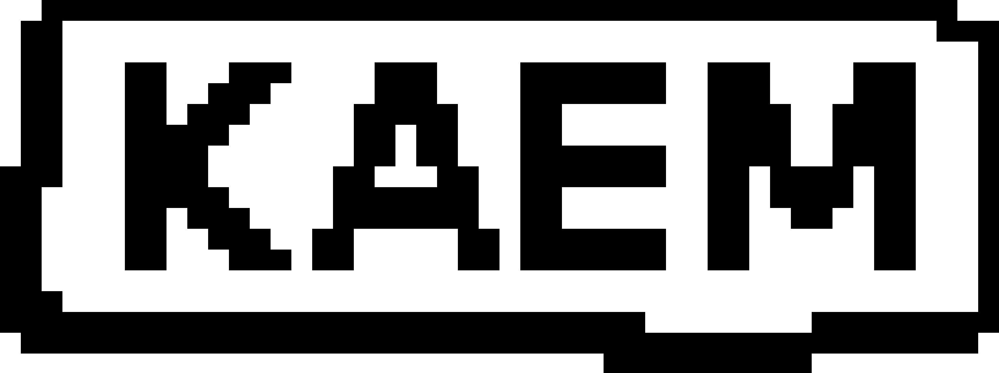

<div align="center" style="margin-top: 40px;">
  
</div>


## What it is

kaem is a chat app that talks over radio. Not the internet. Radio.

Two people run kaem on their machines. The app turns chat messages into
sound waves (FSK signals) and sends them over a radio link. No phone
network needed. No wifi needed. No internet needed. Just radio.

Right now the radio link is simulated in software. It runs over your
local network using UDP to act like real airwaves. Later it will run on
real radio hardware (SDR), so kaem can work in places with no signal at
all.

## Why

Phone networks and the internet can go down. Disasters, blackouts,
remote areas, censorship. Radio still works. kaem builds a chat app on
top of plain radio so people can talk to each other without needing
any of that infrastructure.

It also relays. If two nodes are too far apart to hear each other
directly, other nodes in between can pass the message along. This is
called mesh relay. So the network can grow past the range of one radio.

Messages can also be encrypted, so even though radio is open and
anyone can listen, only the people in a chat can read it.

## How it works

kaem is built from small independent pieces, each one doing one job:

- **link** - turns chat bytes into radio signals and back. This is the
  modem. It also carries the signal over a channel, which today is UDP
  pretending to be radio, and later will be real hardware.
- **sim** - a fake radio world used for testing. Multiple nodes, signal
  loss, distance, all simulated in one process so you can test a mesh
  of many nodes without needing real radios.
- **node** - the actual chat logic. Contacts, messages, who said what.
  Knows nothing about radio or encryption.
- **mesh** - takes encrypted messages and relays them across nodes so
  messages can travel further than one radio can reach.
- **crypto** - locks and unlocks messages so only the right people can
  read them.

Two apps are built from these pieces:

- **kaem** - the actual chat app, a terminal app (TUI) you run to talk
  to someone.
- **kaem-sandbox** - a visual tool for testing. It lets you place many
  fake nodes on a map, watch radio signals travel between them, and see
  the mesh relay messages around. Good for understanding and debugging
  how the network behaves before using real radios.

## Status

This is early. The radio link, the chat, and the mesh relay all work
in simulation today. Real radio hardware support is not built yet.
Expect rough edges and changes.

## Running it

Two chat nodes talking over the simulated radio:

```bash
KAEM_NODE=a cargo run -p kaem
KAEM_NODE=b cargo run -p kaem
```

Run them in two separate terminals and they will find each other.

## NOTE

**Alpha. Still being built. Things will break and change.**